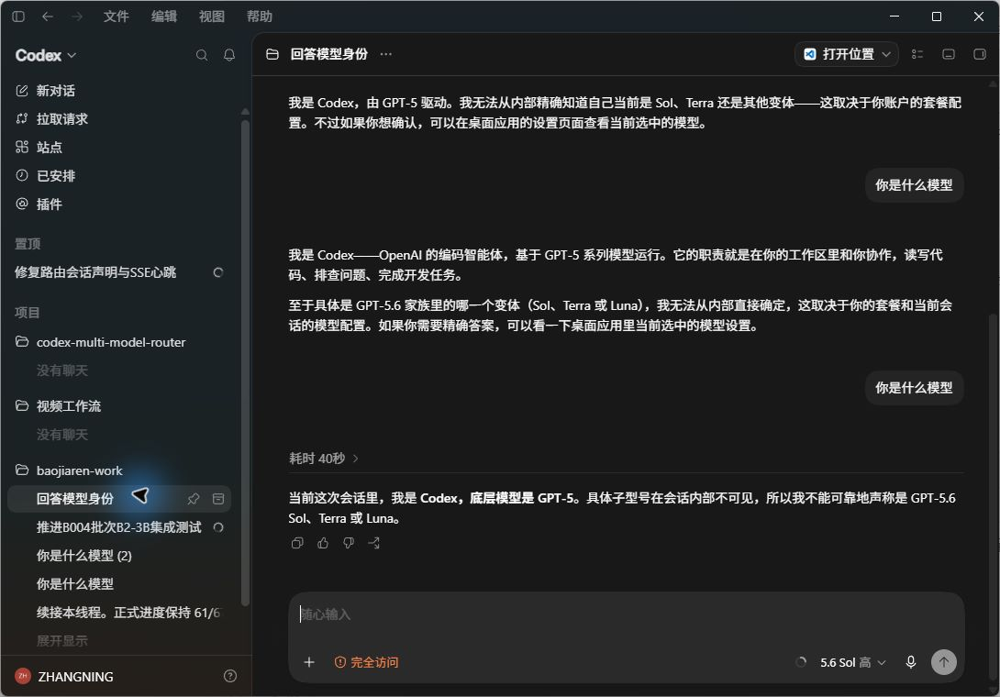

<div align="center">

# Codex Multi-Model Router

**本地多模型路由代理 · Local-First Multi-Model Router & Gateway**

  

**[English](#english) | [简体中文](#简体中文)**

</div>

**English** — A local-first multi-model router & gateway: use official ChatGPT quota, DeepSeek / Qwen / GLM / Kimi / Grok, and your Claude / Gemini / ChatGPT / Cursor subscription accounts in one model menu, for the OpenAI Codex desktop app, Claude Code, or any OpenAI-compatible client. Runs 100% on your own machine; no cloud account required.

**简体中文** — 一个运行在你自己电脑上的**本地多模型路由代理**：让 OpenAI Codex 桌面端（以及任意 OpenAI 兼容客户端）在一个菜单里同时使用**官方 ChatGPT 额度、DeepSeek / Qwen / GLM / Kimi / Grok 等国内外模型、Claude / Gemini / ChatGPT 订阅账号额度、以及 Cursor 订阅额度**，并且可以随时切换。

> **小白一句话**：装好 Node.js → 启动 → 打开网页管理面板 → 点几下把模型和密钥加进去 → 客户端填一个地址就能用。
>
> **Beginner one-liner**: Install Node.js → run it → open the web admin panel → click to add models & keys → point your client at one address. Done.

**关键词 Keywords**：Codex 多模型路由 · Claude Code Router · Gemini CLI · 订阅额度池 · OpenAI 兼容代理 · 本地网关 · 模型切换器 · API 网关 · 免切换 · Codex Router · Subscription Quota Pool · OpenAI-Compatible Proxy · Local Gateway · Model Switcher

---

## English

> [English](#english) | [简体中文](#简体中文)

**目录 Contents**

- [1. What it is / what it can do](#1-what-it-is--what-it-can-do)
- [2. Preparation (3 minutes)](#2-preparation-3-minutes)
- [3. Start & open the admin panel](#3-start--open-the-admin-panel)
- [4. Beginner: add your first model](#4-beginner-add-your-first-model)
- [5. Connect your clients (Codex / Trae / Qoder / OpenCode)](#5-connect-your-clients-codex--trae--qoder--opencode)
- [6. Feature map](#6-feature-map)
- [7. FAQ](#7-faq)
- [8. Security](#8-security)
- [9. Project layout & development](#9-project-layout--development)
- [10. Feedback & community](#10-feedback--community)

A **local multi-model routing proxy** running on your own computer. It lets the OpenAI Codex desktop app (and any OpenAI-compatible client) use, in a single model menu: **official ChatGPT quota, domestic & international models (DeepSeek / Qwen / GLM / Kimi / Grok …), Claude / Gemini / ChatGPT subscription accounts, and Cursor subscription quota** — switchable at any time.

### 1. What it is / what it can do

The Codex desktop app allows "only one model provider at a time". This project puts a router in the middle:

```
Codex desktop / any client ──▶ 127.0.0.1:15730 (this project)
   ├─ Official channel (gpt-*/codex-*) ────▶ chatgpt.com (reuses desktop login)
   ├─ DeepSeek / Qwen / GLM / Kimi ───────▶ vendor OpenAI-compatible APIs
   ├─ Claude / Gemini / ChatGPT subs ─────▶ your membership quota (multi-account rotation)
   ├─ Cursor Pro subscription ────────────▶ built-in gateway, multi-account pool
   └─ …… any OpenAI-compatible endpoint
```

Point your client's `base_url` at `http://127.0.0.1:15730/v1`; the router forwards each request to the right upstream based on the `model` field.

**Core capabilities:**

| Capability | What it means |
| --- | --- |
| Multi-model, one menu | Official GPT and third-party models share one selector; switch anytime without touching configs |
| Web admin panel | Add/edit/remove models, test connectivity, one-click vendor onboarding, manage key pools & subscription accounts — all in your browser |
| Text & image dual channel | `/v1/responses` (Codex) and `/v1/chat/completions` (universal), native streaming |
| **Google subscription channel** | One-click Google AI Pro onboarding: the full gemini / claude family (25+ models) on your subscription quota; account-pool failover, thinking-tier variants, automatic tool-schema sanitization |
| **One-click Codex account switch** | Switch the Codex desktop app to any bound ChatGPT account from the panel (auto-backup, auto-restart, bidirectional) |
| **Live subscription quota panel** | ChatGPT accounts show 5-hour / weekly quota progress bars with reset times (same data source as the Codex CLI quota bar) |
| Vision relay ("borrowed eyes") | When a text-only model receives an image, a vision model describes it first; multi-endpoint with automatic failover |
| ChatGPT subscription image generation | `/v1/images/generations` & `/v1/images/edits` translated into official Responses + image_generation calls, billed to your ChatGPT subscription (platform key as fallback) |
| Multi-account subscription pool | Bind multiple Claude / Gemini / ChatGPT / Cursor accounts; automatic failover when quota runs dry; per-account drain order |
| Channel key pools | Multiple API keys per vendor with priority rotation and persisted 429 cooldown |
| Free-form model groups | Model cards can be freely edited / deleted / regrouped |
| Per-channel proxy | Each channel can go direct / via global proxy / via a custom node (paste ss / trojan / vless / socks5 / http links) |
| Cross-model continuation | Context trimming auto-generates a "goal checkpoint" so switching models never drops the task |
| Usage dashboard | Daily token trends, activity heatmap, per-model breakdown |
| Optional API key auth | Issue `sk-router-*` keys to control who may access |

Screenshots:




### 2. Preparation (3 minutes)

1. Install **Node.js 18 or newer** ([nodejs.org](https://nodejs.org), next-next-next is fine).
2. Prepare **your own** vendor API keys (DeepSeek open platform, Alibaba Bailian, SiliconFlow, OpenRouter, …). This project ships **no built-in keys**.
3. Download and extract this project's source to any directory, e.g. `D:\codex-multi-model-router`.

No npm install needed (pure Node.js — `npm start` just runs).

### 3. Start & open the admin panel

Windows:

```powershell
cd D:\codex-multi-model-router
.\scripts\start-router.ps1
```

macOS / Linux:

```bash
cd ~/codex-multi-model-router
./scripts/start-router.sh
```

When the log prints `codex-router listening on 127.0.0.1:15730`, open the admin panel in your browser:

```
http://127.0.0.1:15730/admin
```

> The panel binds to localhost (127.0.0.1) only and works under same-origin + anti-cross-site policies; it is never exposed to your LAN.

### 4. Beginner: add your first model

There are many ways to add models in the panel; the easiest is "one-click vendor onboarding":

1. Open the **model groups** page.
2. Click **one-click vendor onboarding** (top right) — a built-in list of common vendors (DeepSeek, Qwen, GLM, OpenRouter, …), grouped by region.
3. Pick a vendor, paste the API key(s) you applied for on that platform (multiple keys welcome — automatic failover), then click **onboard**.
4. The router automatically: creates the channel → puts the keys into the channel key pool → writes the vendor's default models into the catalog.

The models now appear in your client's model menu.

If you'd rather add an arbitrary OpenAI-compatible model manually:

- In **system & routing config → enabled target channels**, click "add channel": fill in the channel name, match regex (e.g. `^deepseek-`), host (e.g. `api.deepseek.com`), path prefix (usually `/v1`), and the key's env-var name.
- On the model-groups page, click "add custom model" and map the model slug to that channel.

> **Where do keys go?** This project insists "keys never live in config files". Put keys into **environment variables** (Windows: `setx VAR_NAME your_key`, e.g. `setx DEEPSEEK_API_KEY sk-xxx`) and reference only the variable name in the channel. Alternatively, paste plaintext keys into the panel's channel key pool — they are stored in the router's own local database, never written into `config.json`.

### 5. Connect your clients (Codex / Trae / Qoder / OpenCode)

Universal (any OpenAI-compatible client):

| Setting | Value |
| --- | --- |
| Base URL | `http://127.0.0.1:15730/v1` |
| API Key | a `sk-router-...` created on the panel's API-key page (create none = open access) |
| Chat endpoint | `POST /v1/chat/completions` (universal) |
| Codex endpoint | `POST /v1/responses` (Codex) |
| Model list | `GET /v1/models` |

Codex desktop app — the primary use case: let the app see every model and still open reliably. The catalog is managed dynamically by the panel's model-groups page and written into the `models.json` the desktop app reads:

- Make sure the catalog file the desktop app reads is the one this router writes (`$CODEX_HOME\models.json` by default on this machine).
- Set the desktop app's `base_url = http://127.0.0.1:15730/v1`; models appear in the bottom-right selector automatically.
- When switching across Chat / Responses, the router re-attaches full history plus a goal checkpoint, so task context survives.

> The desktop app parses `models.json` strictly. This project **auto-fills every desktop-required field** (including `supported_in_api`, `priority`, `base_instructions`, …) when writing models, so the catalog always parses and the app keeps opening.

Trae / Qoder / OpenCode etc.: they all support "OpenAI-compatible" config — just set the Base URL above. The API-key page also shows ready-made setup snippets for each key you create.

### 6. Feature map

Full details in [docs/ADVANCED.md](docs/ADVANCED.md). Quick map of "what can it do for me":

- **Membership subscription auth** (admin panel)
  - Claude / Gemini / ChatGPT member accounts: one-click OAuth or manual token, multi-account rotation, auto token refresh.
  - **Google AI Pro**: on the subscriptions page, the Google account card's "connect to router" pulls your subscription model list (full gemini / claude family) into the router; thinking tiers (`-high` / `-medium` / `-low`) auto-synthesize variants; agent tool definitions carrying Gemini-unsupported fields (`$schema` / `propertyNames` …) are auto-sanitized — no more 400s.
  - **Quota panel**: every ChatGPT account shows live 5-hour / weekly quota bars (captured from official response headers, same source as the Codex CLI quota bar); click "refresh" to update. Google accounts show a local 7-day request counter.
  - **Drain order**: each account card has a "drain order" number — lower numbers get drained first (empty = auto by plan tier, Pro first).
  - **One-click Codex switch**: on a ChatGPT account card, "switch Codex to this account" → signs out the current login (backed up) → writes that account's credentials → restarts the desktop app; bidirectional, usable ~10 seconds later.
  - Cursor Pro subscription: a built-in gateway converts subscription quota into an OpenAI-compatible API; add/remove `crsr_` keys to the account pool right in the panel.
- **Channel key pools**: multiple keys per channel, priority rotation + persisted 429 cooldown; falls back to the env var once the whole pool cools down.
- **Free-form model groups**: cards are freely editable / deletable; type a new group name to create a group (browser-local, never written into the desktop catalog); "one-click vendor onboarding" can pull the real model list to pick from.
- **Graceful restart**: the panel header's "graceful restart" swaps in new code without killing in-flight tasks.
- **Usage stats**: daily token trends, activity heatmap, per-model breakdown.
- **Full Codex plugin adaptation**: Codex tool declarations (shell, file editing, MCP, web search, …) are converted into each upstream's generic tool format.

### 7. FAQ

**Q: The client can't reach 15730?**
Make sure the router is running (log shows `listening`) and you used `http://127.0.0.1:15730/v1` — not `https`, not a public IP. If the panel opens but the client can't connect, it's almost always a wrong address/port.

**Q: A model keeps reporting "quota exceeded / 429"?**
The channel key may be exhausted, or a subscription account ran dry. Check cooldown status on the key-pool page, or account status on the subscriptions page; quota recovers automatically — no config change needed. For ChatGPT accounts, read the 5-hour / weekly bars on the account card.

**Q: Google models report 429 "per-minute quota limit"?**
Google rate-limits per "account × model" minute window (agent clients resend full context every turn, so it burns fast). The router auto-rolls to another account; if every account is inside the window, it recovers in about a minute — the error text says so. Failures lasting hours mean daily/weekly quota is used up: wait for reset or switch models (e.g. `claude-sonnet-4-6` / `gemini-2.5-flash` family). Agent clients often send `max_tokens=128000`; the router clamps it to a safe value so the pre-check won't 429.

**Q: A ChatGPT account on the subscriptions page shows "no quota data yet"?**
Quota arrives with official-channel response headers; there is no standalone query endpoint. Make one request with that account on an official model, then click "refresh".

**Q: "Unknown model / model not found"?**
The requested model name isn't in the catalog. Check it exists on the model-groups page and that its channel's match regex hits.

**Q: Added a model / changed config but nothing seems to change?**
You edited the disk config; the in-memory router needs a restart. Use the header's "graceful restart", or run `.\scripts\restart-router.ps1` / `bash scripts/restart-router.sh`.

**Q: Desktop app won't open / config_load error?**
Check the desktop log first: `unknown variant` / `missing field` = a `models.json` field problem; `usage limit` = a quota problem. This project auto-fills all required fields, so the former shouldn't happen; if it ever does, re-save any model on the model-groups page to trigger the auto-fix.

**Q: Proxy unreachable / need a global proxy?**
See [docs/ADVANCED.md "network & proxy"](docs/ADVANCED.md). Per-channel proxies are supported; custom proxies accept pasted airport node links (ss / trojan / vless / socks5 / http).

### 8. Security

- **Credentials are read only from environment variables or the local key service**: no usable key literals in source, docs, sample configs, or tests.
- Router API keys are stored hashed (`sk-router-` prefix + SHA-256); revocation is instant. Plaintext keys in channel pools live only in the local SQLite database, never written into `config.json`.
- The admin panel binds to the loopback address only, with Host/Origin/anti-cross-site checks (CSP, same-origin).
- `data/` (runtime database: accounts, keys, login states) is `.gitignore`d and never committed.

### 9. Project layout & development

```
codex-router.mjs          # entry point: assembles modules and listens on 15730
config.json               # sample config (no keys); real keys via env vars
models.json               # model catalog written by the admin panel (not committed)
lib/                      # core modules (routing, admin API, auth, key pools, subscriptions, vision relay…)
web-admin/                # admin panel frontend source (Vue 3 + Element Plus)
web/                      # built frontend assets (used at runtime)
scripts/                  # start / stop / restart / test scripts
test/                     # unit & integration tests (node:test)
```

Development / testing:

```bash
npm test                        # run all unit tests (node --test test/*.test.mjs)
cd web-admin && npm run build   # rebuild the admin panel frontend
```

Built-in mechanisms include multi-channel provider affinity per model, request budgets & timeouts, response history, cross-model goal checkpoints, channel-/account-level quota cooldowns, token tracking & usage stats; the model-catalog writer auto-completes desktop-required fields so configs never get corrupted.

### 10. Feedback & community

If this project helps you, please give it a Star. Feedback is welcome:

- **WeChat**: `b6356120` (mention "router" when adding; I'll invite you to the user group)
- **GitHub Issues**: [open an issue](https://github.com/822807097/codex-multi-model-router/issues)

When reporting, include: which model you used, the exact error text, and a screenshot of the relevant panel page — it makes things much faster.

---

## 简体中文

> [English](#english) | [简体中文](#简体中文)

**目录**

- [一、它是什么 / 能做什么](#一它是什么--能做什么)
- [二、准备工作（3 分钟）](#二准备工作3-分钟)
- [三、启动与打开管理面板](#三启动与打开管理面板)
- [四、小白入门：加第一个模型](#四小白入门加第一个模型)
- [五、让客户端连上来（Codex / Trae / Qoder / OpenCode）](#五让客户端连上来codex--trae--qoder--opencode)
- [六、常用功能一览](#六常用功能一览)
- [七、常见问题（遇到问题先看这里）](#七常见问题遇到问题先看这里)
- [八、安全说明](#八安全说明)
- [九、目录与开发](#九目录与开发)
- [十、反馈与交流](#十反馈与交流)

### 一、它是什么 / 能做什么

你的 Codex 桌面端「同一时间只能配置一个模型供应商」。本项目在中间加一个「路由器」：

```
Codex 桌面端/任意客户端 ──▶ 127.0.0.1:15730（本项目）
   ├─ 官方通道（gpt-*/codex-*）──────▶ chatgpt.com（复用桌面端登录态）
   ├─ DeepSeek / Qwen / GLM / Kimi ──▶ 各厂商 OpenAI 兼容 API
   ├─ Claude / Gemini / ChatGPT 订阅 ─▶ 用你的会员账号额度（多账号自动轮换）
   ├─ Cursor Pro 订阅 ────────────────▶ 通过内置网关多账号额度池
   └─ …… 任意 OpenAI 兼容接口
```

你只需要把客户端的 `base_url` 指向 `http://127.0.0.1:15730/v1`，路由器按请求里的 `model` 字段转发到对应的上游。

**核心能力：**

| 能力 | 说明 |
| --- | --- |
| 多模型同菜单共存 | 官方 GPT 与任意第三方程在同一个选择器里，随时切换，不用改配置 |
| 网页管理面板 | 浏览器打开即可增删改模型、测速、一键接入厂商、管理密钥池与订阅账号 |
| 图文双通道 | 支持 `/v1/responses`（Codex）、`/v1/chat/completions`（通用），原生流式 |
| **谷歌订阅通道** | Google AI Pro 会员一键接入：gemini / claude 全系 25+ 模型经路由直用订阅额度；账号池故障转移、思考档位变体、工具 Schema 自动净化 |
| **Codex 账号一键切换** | 管理页一键把 Codex 桌面端切换到任意已绑定的 ChatGPT 账号（自动备份原登录、自动重启，双向互切） |
| **订阅额度实时面板** | ChatGPT 账号显示 5 小时 / 周额度进度条与重置时间（与 Codex CLI 官方额度条同源数据） |
| 视觉中继「借眼看图」 | 纯文本模型收到图片时，自动让视觉模型描写后再交给文本模型；支持多端点、额度耗尽自动切换 |
| ChatGPT 订阅生图 | `/v1/images/generations` 与 `/v1/images/edits` 翻译成官方 Responses + image_generation 通道，用 ChatGPT 订阅账号额度出图（`api.openai.com` 上游，平台 key 兜底） |
| 多账号订阅额度池 | Claude / Gemini / ChatGPT / Cursor 会员账号可以绑多个，额度耗尽自动换下一个；每个账号可设「额度消耗顺序」 |
| 通道密钥池 | 同一个厂商可以挂多把 API Key，优先级轮换 + 额度冷却持久化 |
| 自由分组管理 | 模型卡片可自由编辑 / 删除 / 自建分组（分组只是本页展示，不写桌面端目录） |
| 代理逐通道配置 | 每通道可直连 / 走全局代理 / 走自定义节点（支持粘贴 ss / trojan / vless / socks5 / http 链接） |
| 跨模型接续 | 上下文裁剪时自动生成「目标检查点」，切换模型后任务目标不断线 |
| 用量看板 | 网页里看按天 Token 趋势、活跃热力图、各模型消耗 |
| API 密钥鉴权（可选） | 为自己的客户端签发 `sk-router-*` 密钥，可管控谁能访问 |

界面预览：


### 二、准备工作（3 分钟）

1. 安装 **Node.js 18 或更高版本**（[nodejs.org](https://nodejs.org)，一路下一步即可）。
2. 准备你**自己的**模型服务商 API Key（例如 DeepSeek 开放平台、阿里云百炼、硅基流动、OpenRouter 等）。本项目**自身不含任何内置密钥**。
3. 下载并解压本项目源码到任意目录，例如 `D:\codex-multi-model-router`。

不需要安装任何 npm 依赖（纯 Node.js 实现，`npm start` 直接跑）。

### 三、启动与打开管理面板

#### Windows

```powershell
cd D:\codex-multi-model-router
.\scripts\start-router.ps1
```

#### macOS / Linux

```bash
cd ~/codex-multi-model-router
./scripts/start-router.sh
```

看到日志里出现 `codex-router listening on 127.0.0.1:15730` 说明启动成功。

浏览器打开管理面板：

```
http://127.0.0.1:15730/admin
```

> 管理面板只监听本机（127.0.0.1），并且在同源 + 防跨站策略保护下工作，不会暴露到局域网。

### 四、小白入门：加第一个模型

在管理面板里加模型的路径非常多，最省事的是「一键接入厂商」：

1. 进入 **「分组自定义模型」** 页面。
2. 点右上角 **「一键接入厂商」**，会看到内置的常用厂商列表（DeepSeek、通义、GLM、OpenRouter 等），按地区分类。
3. 选一个厂商，把你在该平台申请的 API Key 填进去（可以填多把，额度耗尽自动换），点 **「一键接入」**。
4. 路由会自动：创建好通道 → 把密钥放进通道密钥池 → 把默认模型写进目录。

之后在客户端模型菜单里就能看到这些模型了。

如果你想完全手动添加一个「任意 OpenAI 兼容模型」：

- 在 **「系统与路由配置」→ 已启用的路由目标通道** 点「添加通道」：填通道名称、匹配正则（例如 `^deepseek-`）、服务器地址（例如 `api.deepseek.com`）、路径前缀（通常 `/v1`）、密钥环境变量名。
- 在 **「分组自定义模型」** 页点「添加自定义模型」，把模型 Slug 和它要走的通道对上。

> **密钥怎么填：** 本项目坚持「密钥不进配置文件」。请把密钥放进**环境变量**（Windows 命令行执行 `setx 变量名 你的密钥`，例如 `setx DEEPSEEK_API_KEY sk-xxx`），然后在通道里只填**变量名**。管理面板里的「通道密钥池」也可以直接填明文 Key，它存在路由自己的本地数据库里，不会写进 `config.json`。

### 五、让客户端连上来（Codex / Trae / Qoder / OpenCode）

#### 通用方式（任意 OpenAI 兼容客户端）

| 配置项 | 值 |
| --- | --- |
| Base URL | `http://127.0.0.1:15730/v1` |
| API Key | 管理面板「API 密钥管理」里创建的 `sk-router-...`（不创建时走开放直连） |
| Chat 接口 | `POST /v1/chat/completions`（通用） |
| Codex 接口 | `POST /v1/responses`（Codex 专用） |
| 模型列表 | `GET /v1/models` |

#### Codex 桌面端

整个项目的主要使用场景——让桌面端能选到所有模型、且能正常打开。模型目录由管理面板「分组自定义模型」页动态管理，写进桌面端读取的 `models.json`：

- 确保桌面端读取的目录文件就是路由器写的这一个（本机默认是 `$CODEX_HOME\models.json`）。
- 桌面端的连接配好 `base_url = http://127.0.0.1:15730/v1` 即可，模型自动出现在右下角选择器。
- 跨 Chat / Responses 切换时，路由器会用全量历史 + 目标检查点续接，不会丢失任务上下文。

> 桌面端对 `models.json` 有严格的字段完整性要求。本项目在写入新模型时会**自动补全所有桌面端必填字段**（含 `supported_in_api`、`priority`、`base_instructions` 等），保证目录永远可被桌面端解析，不会因为漏字段导致应用打不开。

#### Trae / Qoder / OpenCode 等

它们大都支持「OpenAI 兼容」配置，把 Base URL 填成上面的地址即可。也可以到「API 密钥管理」页看你创建的 Key 对应的接入指引，里面有现成配置模板。

### 六、常用功能一览

详细说明见 [docs/ADVANCED.md](docs/ADVANCED.md)，这里先给你「这东西能干嘛」的地图：

- **平台会员订阅授权**（管理面板）
  - Claude / Gemini / ChatGPT 会员账号：一键 OAuth 授权或手动填 Token，多账号自动轮换，Token 自动续期。
  - **谷歌 AI Pro**：订阅页 Google 账号卡「一键接入路由通道」→ 自动拉取订阅模型清单（gemini / claude 全系）并写入路由；支持思考档位（`-high` / `-medium` / `-low` 自动合成变体）。智能体发来的工具定义若带 Gemini 不支持的字段（`$schema` / `propertyNames` 等）会自动净化，不会再 400。
  - **额度面板**：每个 ChatGPT 账号实时显示 5 小时 / 周额度进度条（数据与 Codex CLI 内置额度条同源，随响应头自动捕获），点「刷新」即更新；谷歌账号显示本地 7 天请求计数。
  - **账号消耗顺序**：每个账号卡有「额度消耗顺序」数字框，数字越小越先消耗该账号额度（留空 = 自动按套餐档位 Pro 优先）。
  - **Codex 账号一键切换**：ChatGPT 账号卡「切换 Codex 到此账号」→ 自动退出当前登录（备份）→ 写入该账号凭据 → 自动重启桌面端；双向互切，切换后约 10 秒可用。
  - Cursor Pro 订阅：内置网关把订阅额度转成 OpenAI 兼容接口，面板里直接加/删 `crsr_` Key 进账号池。
- **通道密钥池**：同通道多把 Key，优先级轮换 + 429 冷却持久化，池全冷却再回退环境变量。
- **分组自定义模型**：模型卡片可自由编辑 / 删除；输入新分组名即自建分组（存浏览器本地，不写桌面端目录）；「一键接入厂商」可拉取真实模型清单勾选添加。
- **优雅重启**：面板顶栏「优雅重启服务」在不停当前任务的情况下换新代码。
- **用量统计**：按天 Token 趋势、活跃热力图、模型消耗 Breakdown。
- **Codex 插件全适配**：自动把 Codex 的工具声明（shell、文件编辑、MCP、联网搜索等）转换成各上游通用工具格式。

### 七、常见问题（遇到问题先看这里）

**Q：客户端提示连不上 15730？**
先确认路由进程在跑（日志有 `listening`），再确认填的是 `http://127.0.0.1:15730/v1` 而不是 `https` 或外网 IP。管理面板能打开但客户端连不上，多半是端口/地址填错。

**Q：某个模型一直报「额度不足 / 429」？**
该通道密钥可能真的用完了，或订阅账号额度耗尽。到「通道密钥池」看冷却状态，或到「平台订阅」页检查账号状态；额度会自动续，不用改配置。ChatGPT 账号的 5 小时 / 周额度看账号卡上的进度条即可。

**Q：谷歌模型报 429「分钟级配额限制」？**
谷歌按「账号 × 模型」分钟窗口限流（智能体每轮带全量上下文，消耗快）。路由会自动换账号重试；若全部账号都在窗口内，等约 1 分钟自动恢复——错误信息里会写明。持续数小时不行的是日/周配额用尽，只能等重置或换其他模型（如 `claude-sonnet-4-6` / `gemini-2.5-flash` 系）。另外智能体客户端常发 `max_tokens=128000`，路由已自动钳制到安全值，不会因此预检 429。

**Q：订阅页 ChatGPT 账号显示「暂无额度数据」？**
额度随官方通道响应头返回，没有独立查询接口。让该账号产生一次请求（用官方模型对话一轮）后点「刷新」即可显示。

**Q：模型报「Unknown model / 找不到模型」？**
客户端请求的模型名不在目录里。到「分组自定义模型」页确认该模型存在，且它的通道匹配正则能命中。

**Q：加了新模型 / 改了配置，好像没生效？**
改的是磁盘配置，已加载进内存的路由需要重启。用面板顶栏「优雅重启服务」，或在命令行执行 `.\scripts\restart-router.ps1` / `bash scripts/restart-router.sh`。

**Q：桌面端打不开、报 config_load 错误？**
先看桌面端日志分辨原因：`unknown variant` / `missing field` 属于 `models.json` 字段问题，`usage limit` 属于额度问题。本项目写模型时会自动补全完整字段，正常情况下不会再出现前者；若偶发，到「分组自定义模型」页随便保存一次该模型即可触发补全修复。

**Q：代理连不上 / 需要全局代理？**
见 [docs/ADVANCED.md「网络与代理」](docs/ADVANCED.md)。逐通道可配代理，自定义代理支持直接粘贴机场节点链接（ss / trojan / vless / socks5 / http）。

### 八、安全说明

- **凭据只从环境变量或本地密钥服务读取**：源码、文档、示例配置和测试里都不含任何可用密钥字面量。
- API Key 以哈希形式存储（`sk-router-` 前缀 + SHA-256），吊销即时生效；通道密钥池里的明文 Key 只存本地 SQLite，不写入 `config.json`。
- 管理面板仅绑定本机回环地址，并做 Host/Origin/跨站（CSP、同源）校验。
- `data/`（运行时数据库：账号、密钥、登录态）已加入 `.gitignore`，提交/开源时不会带出。

### 九、目录与开发

```
codex-router.mjs          # 程序入口：组装各模块并启动 15730 监听
config.json               # 示例配置（不含密钥）；真实密钥走环境变量
models.json               # （由管理面板写入的模型目录，不入库）
lib/                      # 核心模块（路由、管理 API、鉴权、密钥池、订阅、视觉中继……）
web-admin/                # 管理面板前端源码（Vue 3 + Element Plus）
web/                      # 前端构建产物（面板运行时使用）
scripts/                  # 启动 / 停止 / 重启 / 测试脚本
test/                     # 单元与集成测试（node:test）
```

开发 / 测试：

```bash
npm test                 # 运行全部单元测试（node --test test/*.test.mjs）
cd web-admin && npm run build   # 重新构建管理面板前端
```

已内置同一模型多通道 provider 亲和、请求预算与超时、响应历史、跨模型目标检查点、通道级/账号级额度冷却、令牌追踪与用量统计等机制；会在写入模型目录时自动保证桌面端必填字段完整，避免配置被写坏。

### 十、反馈与交流

用得好请点个 Star；遇到问题欢迎反馈：

- **微信**：`b6356120`（添加请备注「路由器」，会拉交流群）
- **GitHub Issues**：[提交 Issue](https://github.com/822807097/codex-multi-model-router/issues)

提问题时尽量附上：用的哪个模型、报错原文、管理面板对应页面的截图，定位更快。

---

<div align="center">

**MIT License** · 本项目仅做本地网关聚合，与 OpenAI / Anthropic / Google / Cursor 等公司无任何关联；请遵守各平台的服务条款，风险自担。

This project is a local gateway aggregator only and is not affiliated with OpenAI / Anthropic / Google / Cursor. Please comply with each platform's terms of service — use at your own risk.

</div>
