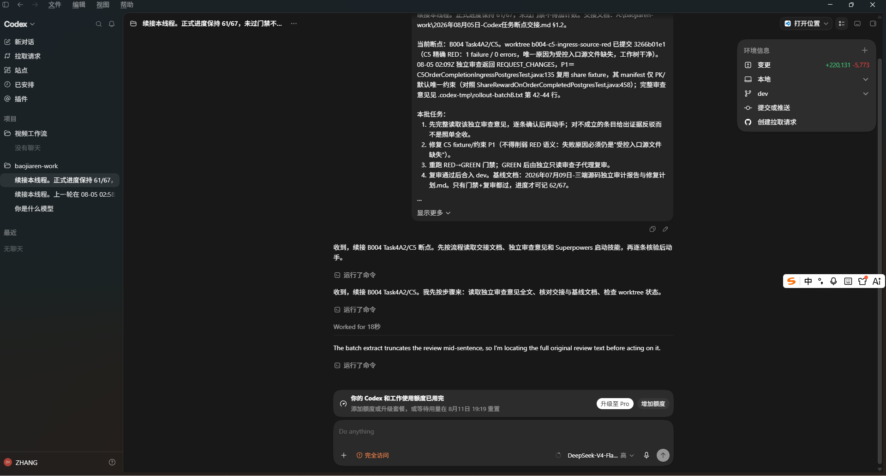

# codex-multi-model-router

Codex 桌面端本地多模型路由代理，让官方 GPT、DeepSeek、Qwen 等模型在同一选择器里共存，并为文本模型提供视觉中继能力。

## 特性

- **多模型共存**：官方 GPT 系列、DeepSeek、Qwen 等模型同时出现在 Codex 桌面端选择器中，会话内可热切换
- **持续目标检查点**：长任务触发旧轮次裁剪时，自动保留目标、硬性约束、进度、决定、工作集、失败记录和下一步
- **跨模型任务接力**：同一强任务键下切换 DeepSeek、Qwen、官方 GPT 等模型时迁移任务语义，不迁移供应商私有会话状态
- **原生 Responses 优先**：已支持 Responses 的模型（默认含 DeepSeek V4 Flash）原样透传，其他 OpenAI-compatible 模型走 Chat 真流式转换
- **Responses ↔ Chat 真流式转换**：对 `wireApi: "chat"` 的通道实时转换 Chat SSE，支持文本、推理和并行 `tool_calls` 分片
- **国内外供应商适配**：显式区分 DeepSeek、百炼/通义、硅基流动、OpenRouter、MiniMax 与通用 OpenAI-compatible 网关的推理字段
- **逐通道网络策略**：官方模型和任意自定义模型都可独立选择直连或经本地 HTTP CONNECT 代理
- **工具调用转换**：自动转换 `tools` 定义与 `tool_calls`/`tool` 结果，按 index/call ID 重组异常分片
- **视觉中继**：为不支持图片的文本模型（如 DeepSeek）提供“借眼”能力——收到图片时先调用视觉模型生成描述，注入上下文后转发
- **无感更新**：`/_admin/shutdown` 优雅退出 + 新进程立即接管，更新路由不打断在跑任务
- **并发安全**：Node 事件循环 + 每请求独立状态 + 进程级异常兕底，多任务并发不崩溃
- **1M 上下文**：`modelContext` 配置写回 models.json，支持 DeepSeek-V4-Flash 1M 上下文窗口
- **零依赖**：纯 Node.js 实现，无需任何 npm 包，Node >= 18 即可运行
- **密钥安全**：API Key 全部通过环境变量注入，配置文件无明文
- **官方登录态复用**：自动读取 Codex 桌面端 auth.json，临期自动 refresh（single-flight 防并发竞态），无需二次登录
- **一键运维**：提供启动/停止/重启/状态/测试/恢复官方配置/恢复自定义配置 7 个脚本

## 演示

### 自定义模型共存 + 同一任务内切换

官方 GPT、DeepSeek、Qwen 等国内外模型可以同时出现在 Codex 桌面端的同一个模型菜单中。任务执行过程中无需新建聊天，可在当前聊天窗口逐轮切换任意已配置模型；路由会根据每轮请求中的 `model` 重新选路。未裁剪历史继续由桌面端随请求提供，路由负责补齐工具调用配对，并在裁剪发生时注入持续目标检查点。


> 模型切换从下一轮请求生效。若当前回复仍在流式输出，请先等待本轮完成或主动停止；路由不会把半条回复、未完成工具调用或旧供应商的私有会话状态迁移给新模型。

### 多模型共存 + 深度推理

DeepSeek-V4-Flash 在 Codex 桌面端处理复杂代码审查任务，支持会话内热切换模型：



### 视觉中继：文本模型"借眼"看图

给 DeepSeek-V4-Flash 发送截图，路由自动调用 Qwen3.8-Max 生成图片描述，DeepSeek 基于描述回答：


## 架构

```
Codex 桌面端 ──▶ 127.0.0.1:15730 (router)
   ├─ gpt-*/codex-*  ──▶ 直连或本地代理 ──▶ chatgpt.com（复用桌面端登录态）
   ├─ deepseek-v4-flash ─▶ 原生 Responses ─▶ api.deepseek.com（环境变量 key）
   ├─ 其他 deepseek-*   ─▶ Chat 兼容转换 ──▶ api.deepseek.com（环境变量 key）
   └─ qwen*          ──▶ 直连或本地代理 ──▶ 阿里云 Token Plan（环境变量 key）
```

Chat 通道的长任务上下文流程：

```text
Responses 全量历史 → Responses→Chat 转换 → 完整轮次预算
  ├─ 未裁剪旧轮次：直接调用当前模型
  └─ 裁剪旧轮次：目标锚点 + 旧检查点 + 有界旧历史
                    → 当前模型非流式生成九栏目检查点
                    → assistant 历史注入 → 主请求真流式输出
```

检查点只驻留在路由进程内，并通过强任务键关联。摘要失败时优先复用同一任务上一份已校验检查点；没有可用检查点时才降级为原有完整轮次裁剪，不阻断主任务。路由不会伪造官方 Responses compaction item，也不会把 `previous_response_id` 声明成完整会话能力。

视觉中继流程（文本模型收到图片时）：
```
用户发图 / 插件回传截图 → 路由拦截 → 调用视觉模型写描述 → 替换为 [image description: ...] → 转发给文本模型
```

中继覆盖两类图片来源：
- **用户直接贴图**（user 消息的 content）
- **浏览器/电脑操作插件回传的屏幕截图**（function_call_output 的 output）

> 注意：视觉中继是“借眼”方案，适合理解截图内容（报错、UI、代码）。若要做**精确的 GUI 自动化操作**（browser / computer-use 插件），建议切换到原生视觉模型（qwen3.8-max 或官方 GPT），因为 2-4 句描述不足以支撑像素级定位。

## 快速开始

### 1. 环境变量

设置以下 Machine 级环境变量：

```
DEEPSEEK_API_KEY=sk-xxx
aliyun_video_key=sk-xxx
```

### 2. 模型目录

复制 `models.template.json` 到 `~/.codex/models.json`（或 `CODEX_HOME/models.json`），按需增改模型条目。

**注意**：自定义模型必须包含 `input_modalities: ["text", "image"]` 才能在桌面端发图（前端门控）。

### 3. 配置文件（Codex 接入路由）

编辑 `~/.codex/config.toml`（不存在则新建）：

```toml
model = "gpt-5.6-terra"
model_provider = "router"
model_catalog_json = "~/.codex/models.json"

[model_providers.router]
name = "LocalRouter"
base_url = "http://127.0.0.1:15730/v1"
wire_api = "responses"
requires_openai_auth = true   # 门控钥匙：让桌面端按官方身份放行自定义模型
supports_websockets = false
```

**字段说明**：
- `model_provider = "router"`：把默认供应商指向路由
- `base_url`：路由监听地址（与 config.json 的 `port` 一致）
- `wire_api = "responses"`：桌面端以 Responses API 与路由通信
- `requires_openai_auth = true`：**关键**，桌面端选择器显示自定义模型的前提（门控钥匙）
- `model_catalog_json`：模型目录，决定选择器里有哪些模型

**关键**：`requires_openai_auth = true` 是桌面端选择器显示自定义模型的前提。

### 4. 启动路由

**Windows (PowerShell)**：

```powershell
cd scripts
.\start-router.ps1
```

或使用无窗口启动（适合开机自启）：

```powershell
wscript start-router-silent.vbs
```

**Linux/macOS (bash)**：

```bash
cd scripts
chmod +x *.sh
./start-router.sh
```

后台运行：

```bash
nohup ./start-router.sh > /tmp/codex-router.log 2>&1 &
```

**npm 用户**：

```bash
npm install
npm run start
```

### 5. 验证

```bash
# Windows
.\test-router.ps1

# Linux/macOS
./test-router.sh

# 单元测试（不要求路由正在运行）
npm test

# 集成验收（要求路由已运行）
npm run test:integration
```

预期输出：
```
[路由] 运行中 targets: openai, deepseek-responses, deepseek-chat, bailian
[env] DEEPSEEK_API_KEY 已设置
[env] aliyun_video_key 已设置
[OK]  deepseek-v4-flash -> 回复: OK (1124ms)
[OK]  qwen3.8-max -> 回复: OK (1776ms)
[OK]  视觉中继 deepseek+图片 -> 回复: red
[OK]  官方通道 -> 200 流式正常
总结: 全部通过
```

### 6. 重启 Codex 桌面端

完全退出 Codex（任务管理器确认 ChatGPT.exe 全关）再重开，选择器应显示全部模型。

## 运维脚本

所有脚本提供 PowerShell (`.ps1`) 和 bash (`.sh`) 双版本，自动备份 `config.toml`（带时间戳，永不覆盖）。

| 脚本 | 功能 |
|------|------|
| `start-router.ps1` / `start-router.sh` | 前台启动路由（便于看日志） |
| `start-router-silent.vbs` | 无窗口启动（Windows 开机自启用） |
| `stop-router.ps1` / `stop-router.sh` | 停止路由 |
| `restart-router.ps1` / `restart-router.sh` | 重启路由（改完配置/key 后执行） |
| `status-router.ps1` / `status-router.sh` | 查看路由状态（PID + 健康检查） |
| `test-router.ps1` / `test-router.sh` | 一键验收（改完 key/URL 后运行） |
| `restore-official.ps1` / `restore-official.sh` | 一键恢复官方配置（移除路由，停止服务） |
| `restore-custom.ps1` / `restore-custom.sh` | 一键恢复自定义模型组合 |

**npm 用户**使用 `npm run <script>`（见 `package.json` 的 `scripts` 字段）。

## 配置说明

### 代码结构

- `codex-router.mjs`：本地 HTTP 服务、模型分流、认证与视觉中继编排
- `lib/chat-protocol.mjs`：Responses→Chat 请求转换和安全上下文裁剪
- `lib/chat-stream.mjs`：Chat SSE→Responses SSE 状态机
- `lib/provider-adapters.mjs`：供应商协议、认证和推理字段适配
- `lib/provider-pool.mjs`：会话粘性候选池和严格 failover 分类
- `lib/context-budget.mjs`：每模型上下文能力矩阵、图片与工具完整预算
- `lib/goal-checkpoint.mjs`：持续目标提取、九栏目检查点、强任务键及 TTL/LRU 内存缓存
- `lib/response-history.mjs`：有界 previous_response_id 工具调用历史
- `lib/transport.mjs`：TLS/CONNECT、HTTP/1.1、chunked 与分层超时
- `test/*.test.mjs`：基于 Node `node:test` 的零依赖单元测试

所有可修改参数集中在 `config.json`（与 `codex-router.mjs` 同目录），修改后执行 `restart-router.ps1` 生效。

### config.json 核心结构

以下示例与当前默认配置同步；完整字段和中文说明以仓库中的 `config.json` 为准。

```json
{
  "port": 15730,
  "proxy": { "host": "127.0.0.1", "port": 10808 },
  "timeouts": { "connectMs": 15000, "responseHeaderMs": 120000, "streamIdleMs": 600000, "requestMs": 600000 },
  "paths": { "auth": null, "catalog": null },
  "oauth": { "client_id": "app_EMoamEEZ73f0CkXaXp7hrann", "refresh_skew_seconds": 30, "viaProxy": null },
  "targets": [
    {
      "match": "^(gpt-|codex-|o\\d|computer-use)",
      "name": "openai",
      "platform": "openai",
      "host": "chatgpt.com",
      "prefix": "/backend-api/codex",
      "viaProxy": true,
      "vision": true,
      "wireApi": "responses"
    },
    {
      "match": "^deepseek-v4-flash$",
      "name": "deepseek-responses",
      "platform": "deepseek",
      "host": "api.deepseek.com",
      "prefix": "/v1",
      "viaProxy": false,
      "vision": false,
      "envKey": "DEEPSEEK_API_KEY",
      "wireApi": "responses"
    },
    {
      "match": "^deepseek-(?!v4-flash$)",
      "name": "deepseek-chat",
      "platform": "deepseek",
      "host": "api.deepseek.com",
      "prefix": "",
      "viaProxy": false,
      "vision": false,
      "envKey": "DEEPSEEK_API_KEY",
      "wireApi": "chat"
    },
    {
      "match": "^qwen",
      "name": "bailian",
      "platform": "dashscope",
      "host": "token-plan.cn-beijing.maas.aliyuncs.com",
      "prefix": "/compatible-mode/v1",
      "viaProxy": false,
      "vision": true,
      "envKey": "aliyun_video_key",
      "wireApi": "chat"
    }
  ],
  "supportsResponses": {
    "slugs": ["deepseek-v4-flash", "qwen3.8-max"]
  },
  "goalCheckpoint": {
    "enabled": true,
    "maxEntries": 128,
    "maxResponseIdsPerTask": 128,
    "ttlMs": 86400000,
    "sourceTokenBudget": 128000,
    "sourceWindowRatio": 0.2,
    "maxOutputTokens": 2048,
    "requestMs": 120000
  },
  "modelContext": {
    "enabled": true,
    "contextWindow": 1000000,
    "autoCompactTokenLimit": 400000,
    "slugs": ["deepseek-v4-flash", "deepseek-v4-pro", "qwen3.8-max"]
  },
  "visionRelay": {
    "host": "token-plan.cn-beijing.maas.aliyuncs.com",
    "prefix": "/compatible-mode/v1",
    "model": "qwen3.8-max",
    "envKey": "aliyun_video_key",
    "viaProxy": false,
    "prompt": "Describe this image concisely (2-4 sentences) for a coding assistant that cannot see it. Focus on text/UI elements/code/error messages if present.",
    "maxTokens": 300
  }
}
```

### 字段说明

**顶层**
- `port`：路由监听端口（默认 15730）
- `proxy`：所有 `viaProxy: true` 通道共用的本地 HTTP CONNECT 代理地址
- `paths`：auth.json / models.json 路径（null = 使用 CODEX_HOME 默认位置）
- `oauth`：ChatGPT OAuth client_id、刷新提前量和刷新请求网络策略；`viaProxy: null` 默认继承当前官方目标，布尔值可单独覆盖
- `timeouts`：TLS 建连、响应头、流空闲和非流式控制请求的独立超时（毫秒）

**targets[]** — 路由规则，按请求体 `model` 字段收集全部匹配项；同一模型可配置多条目标用于会话粘性和安全 failover
- `match`：正则字符串，匹配模型 ID
- `host`：上游域名
- `protocol` / `port`：默认 `https`/443；`http` 仅用于受信任的本机或内网兼容网关，并始终直连
- `prefix`：上游路径前缀（请求路径 `/v1/responses` 会去掉 `/v1` 后拼到 `prefix` 后）
- `viaProxy`：HTTPS 目标的网络策略；`true` = 经顶层 `proxy` 建立 HTTP CONNECT 隧道，`false` = 直连，不区分官方或自定义供应商；`protocol: "http"` 时忽略此项
- `vision`：`false` = 该通道是文本模型，收到图片时走视觉中继；`true` = 原样透传
- `envKey`：该通道 API key 所在的环境变量名（官方通道不用，走 auth.json）
- `wireApi`：`"responses"` = 原样透传上游原生 Responses（优先）；`"chat"`/`"openai_chat"` = 为不支持 Responses 的兼容网关做 Responses↔Chat 真流式转换
- `platform`：供应商适配器，可选 `openai`、`deepseek`、`dashscope`、`siliconflow`、`openrouter`、`minimax`、`generic`
- `chatPath`：Chat endpoint，默认 `/chat/completions`
- `includeUsage`：是否发送 `stream_options.include_usage`，默认 `true`；不兼容的旧网关可设为 `false`
- `reasoningMode`：可覆盖推理字段映射，支持 `reasoning_effort`、`openrouter`、`enable_thinking`、`reasoning_split`、`none`
- `authType`/`authHeader`：默认 `bearer`；兼容使用 `x-api-key` 或自定义认证头的网关
- `timeouts`：该目标单独覆盖顶层分层超时
- `upstreamModel` / `modelMap`：把桌面端模型 slug 映射成该供应商实际接受的模型名

只有连接失败、HTTP 408、429 和 5xx 会在尚未输出模型事件时换腿；客户端取消、400、401、403 和上下文超限不会重试，避免重复副作用或把错误请求扩散到其他供应商。

**官方通道（`platform: "openai"`）** — 自动适配 chatgpt.com backend-api 的参数限制：请求未显式声明 `store` 时注入 `store: false`，并移除 `max_output_tokens`（上游会以 400 拒绝这两类请求）。只在请求未声明对应字段时生效，不覆盖客户端明确意图。

**supportsResponses** — 兼容旧配置名；列出的模型只在 `/models` 中声明 `streaming: true`。路由只维护有界工具调用历史，不维护完整对话状态，因此不会声明 `previous_response_id`

**modelCapabilities[]** — 按模型正则配置 `contextWindow`、`maxOutputTokens`、安全比例、协议余量和图片预算；优先级高于 target 与全局默认值

**providerPool / responseHistory** — 分别限制供应商粘性映射与工具调用历史的 LRU 数量和 TTL；两者都只驻留内存，重启自动清空

**goalCheckpoint** — Chat 通道的持续目标检查点；只有上下文预算确实删除旧轮次时才调用摘要模型
- `enabled`：是否启用，默认 `true`
- `maxEntries` / `ttlMs`：内存检查点最大数量与存活时间，默认 128 条 / 24 小时
- `maxResponseIdsPerTask`：单个活跃任务最多保留的最近响应别名，默认 128，防止超长任务无界增长
- `sourceTokenBudget`：单次摘要来源硬上限，默认 128K token
- `sourceWindowRatio`：摘要来源最多占当前模型窗口的比例，默认 20%
- `maxOutputTokens`：九栏目检查点最大输出，默认 2048 token
- `requestMs`：非流式摘要调用超时，默认 120 秒

检查点来源中的目标锚点、旧检查点和被裁剪历史都受上述硬预算约束，九个栏目必须完整且顺序固定。摘要响应体另有 256 KiB 硬上限，异常上游不会造成无界内存增长。检查点只缓存结构化摘要、哈希以及有界的任务/响应关联元数据，不缓存完整原始对话。跨模型接力要求显式 conversation/session metadata 或 `x-codex-session-id` 等强任务键；仅模型名、相同目标文本、孤立的 cache key 都不能让不同聊天共享检查点。

**modelContext** — 路由启动时写回 models.json 的上下文窗口配置
- `contextWindow`/`max_context_window`：上下文窗口（DeepSeek-V4-Flash 支持 1M）
- `autoCompactTokenLimit`：超过即触发桌面端压缩
- `slugs`：作用的模型列表

**visionRelay** — 视觉中继配置
- 文本模型（`vision: false`）收到 `input_image` 时，调用这里配置的视觉模型生成描述
- `viaProxy`：视觉模型 API 是否共用顶层 HTTP CONNECT 代理，默认 `false`
- `prompt`：发给视觉模型的提示词
- `maxTokens`：视觉模型最大输出 token 数

### 环境变量优先级

环境变量优先级高于 `config.json`：

| 变量 | 说明 | 默认值 |
|------|------|--------|
| `CODEX_HOME` | Codex 数据目录 | `~/.codex` |
| `CODEX_AUTH_PATH` | 覆盖 auth.json 路径 | `$CODEX_HOME/auth.json` |
| `CODEX_CATALOG_PATH` | 覆盖 models.json 路径 | `$CODEX_HOME/models.json` |
| `ROUTER_PORT` | 监听端口 | `config.json:port` 或 `15730` |
| `V2RAY_HOST` | 代理主机 | `config.json:proxy.host` 或 `127.0.0.1` |
| `V2RAY_PORT` | 代理端口 | `config.json:proxy.port` 或 `10808` |
| `DEEPSEEK_API_KEY` | DeepSeek API Key | - |
| `aliyun_video_key` | 阿里云 Token Plan API Key | - |

## 接入任意 OpenAI 兼容模型（GLM / Kimi / MiMo 等）

路由是**通用**的：任何提供 OpenAI 兼容 `/chat/completions` 的供应商都能接入，不限于 DeepSeek/Qwen。只需两步：

**1. 在 config.json 的 `targets` 加一条通道**（`wireApi: "chat"` 走通用 Chat 转换）：

```json
[
{ "match": "^glm-",   "name": "glm",  "platform": "generic", "host": "open.bigmodel.cn",    "prefix": "/api/paas/v4", "viaProxy": false, "vision": true,  "envKey": "ZHIPU_API_KEY", "wireApi": "chat" },
{ "match": "^kimi-",  "name": "kimi", "platform": "generic", "host": "api.moonshot.cn",     "prefix": "/v1",          "viaProxy": false, "vision": true,  "envKey": "KIMI_API_KEY",  "wireApi": "chat" },
{ "match": "^sf-",    "name": "siliconflow", "platform": "siliconflow", "host": "api.siliconflow.cn", "prefix": "/v1", "viaProxy": false, "vision": true, "envKey": "SILICONFLOW_API_KEY", "wireApi": "chat" },
{ "match": "^or-",    "name": "openrouter", "platform": "openrouter", "host": "openrouter.ai", "prefix": "/api/v1", "viaProxy": true, "vision": true, "envKey": "OPENROUTER_API_KEY", "wireApi": "chat" }
]
```

**2. 在 models.json 加对应模型条目**（slug 与 `match` 对应，并设 `input_modalities`），并在环境变量里设置对应 `envKey`。

- `match` 用模型 ID 前缀正则，命中即用该通道；未命中任何通道时回落到第一个通道（官方）
- 文本模型设 `vision: false` 可启用视觉中继；原生视觉模型设 `vision: true`
- 各供应商 endpoint/前缀以官方文档为准，上面仅为示例

## 网络与代理（逐通道可选）

`viaProxy` 是每条 HTTPS `targets[]` 独立的网络开关，与 `platform`、`wireApi` 和认证方式无关。因此官方 Responses 通道、自定义 Chat 通道以及同一模型的多条候选通道都可以分别选择直连或代理。明确配置为 `protocol: "http"` 的受信任本机/内网目标始终直连，不建立 CONNECT 隧道。

| 模型通道 | `viaProxy: false` | `viaProxy: true` |
|---|---|---|
| 官方 GPT / Codex | 直接连接 `chatgpt.com` | 经顶层 `proxy` 的 HTTP CONNECT 隧道 |
| DeepSeek / Qwen / 其他自定义模型 | 直接连接各自 API | 经同一个本地 HTTP CONNECT 代理 |

默认配置按常见国内网络环境设置：官方 GPT 经代理，DeepSeek 和 Qwen 直连。这只是默认值，不是硬编码；可按实际网络逐条反转。OAuth token 刷新默认继承触发刷新的官方目标策略，因此官方目标改为直连后，`auth.openai.com` 也会直连；只有网络分流有特殊要求时才设置 `oauth.viaProxy` 单独覆盖。

例如，官方模型改为直连：

```json
{
  "match": "^(gpt-|codex-|o\\d|computer-use)",
  "name": "openai",
  "host": "chatgpt.com",
  "prefix": "/backend-api/codex",
  "viaProxy": false,
  "vision": true
}
```

自定义模型改为走代理只需在对应目标上设置：

```json
{
  "match": "^or-",
  "name": "openrouter",
  "platform": "openrouter",
  "host": "openrouter.ai",
  "prefix": "/api/v1",
  "viaProxy": true,
  "envKey": "OPENROUTER_API_KEY",
  "wireApi": "chat"
}
```

代理地址可在 `config.json` 的顶层 `proxy` 字段或环境变量 `V2RAY_HOST` / `V2RAY_PORT` 调整。当前代理协议是 HTTP CONNECT；v2rayN 等客户端应填写其 HTTP/混合端口，而不是仅 SOCKS 端口。若 `viaProxy: true` 但代理未监听，请求会明确失败，并按既有安全 failover 规则决定是否尝试下一候选通道。

## 常见问题

### 桌面端选择器不显示自定义模型

检查 `config.toml` 的 `[model_providers.router]` 是否包含 `requires_openai_auth = true`。这是桌面端门控钥匙，缺少则前端隐藏自定义模型。

### 发图时报 "This model does not support image inputs"

检查 `models.json` 里该模型的 `input_modalities` 是否包含 `"image"`。前端按此字段决定是否允许贴图。

### 视觉中继描述不准确

视觉中继依赖视觉模型的图片理解能力。对截图类图片（报错截图、UI 图）效果最好，因为提示词让它重点提取文字/代码/界面元素。

### 官方通道 429

OpenAI 官方额度用尽，链路正常，等额度重置或升级套餐。

### 第三方模型“闪跳”（从头重推/重复执行工具）

Codex 桌面端对第三方模型每轮重发全量历史，若上游 Responses 支持不完善，模型会“看不懂”历史而从头重推。解决：给该通道设 `wireApi: "chat"`，路由转成 Chat 格式（丢弃 reasoning、正确映射 tool_calls/tool），模型即可连贯续接。

如果上游已完整支持 Responses，应优先设为 `wireApi: "responses"` 原样透传。默认 `deepseek-v4-flash` 已按真实 `/v1/responses` 验收配置为原生通道；原生流可直接以 `response.completed` 收尾，不要求额外发送 Chat 风格 `[DONE]`。

### 超长任务中切换模型会丢失目标或进度吗

不会因为“切换模型”这一动作本身直接丢失。未触发裁剪时，桌面端的完整历史照常发送给新模型；触发裁剪时，路由把目标、约束、已完成/进行中/待完成、关键决定、当前工作集、失败原因和下一步整理成供应商无关检查点。切换模型后的新供应商会在可用任务证据范围内，基于上一份任务检查点和本轮历史重新归一化。

供应商的 response id、prompt cache 句柄、sticky target、隐藏推理和未完成工具调用不会迁移。缺少强任务键时，路由宁可重新摘要，也不会把另一个聊天的检查点串进当前任务。

### 第三方模型不执行工具、只描述计划

Chat 请求必须带 `tools` 定义模型才会发 `tool_calls`。路由已自动转换 `tools`；若仍不执行，检查桌面端是否发送了 tools 字段。

### 子代理并行（collaboration）不可用

子代理并行是 Codex 桌面端对**官方模型**开放的运行时编排特性，第三方模型被标记 `unsupported call`。模型会自动降级为单代理并行 shell，属正常行为（cc-switch/Codex++ 同样如此）。

### 更新路由会打断在跑任务吗

不会。`restart-router.ps1` 先 `POST /_admin/shutdown` 让旧进程释放端口并排空在跑任务，新进程立即接管新请求；在跑的流式任务在旧进程上自然结束。

### 改完环境变量 key 后不生效

路由进程启动时才读取环境变量，必须执行 `restart-router.ps1` 后再跑 `test-router.ps1` 验证。

## 技术细节

- **逐通道 TLS 隧道**：任何 HTTPS 目标都可通过 `viaProxy` 选择直连或本地 HTTP CONNECT 代理；裸写 HTTP/1.1 请求避免 `createConnection` 在该链路上的兼容问题
- **Chunked 解码**：上游 chunked 响应透传时必须先解包，否则 Node `ServerResponse` 会再套一层 chunked 封装，客户端解析直接坏掉（SSE 尤甚）
- **Responses↔Chat 转换**：上游使用 `stream: true`；状态机实时转换文本、`reasoning_content`/`<think>` 和并行工具调用，并在正常断流时补齐 Responses 生命周期
- **分层超时**：DNS/TCP/TLS/CONNECT 建连、响应头、流空闲和控制类请求分别计时，客户端断开会取消上游 socket
- **SSE 保活**：Chat 通道在视觉中继和认证之前立即建立 SSE，每 15 秒发送注释心跳
- **目标感知裁剪**：只删除完整旧轮次；确实发生裁剪时才调用当前候选供应商以非推理模式生成九栏目检查点，失败时先复用同任务旧检查点，再降级为普通裁剪
- **摘要内存边界**：目标锚点、旧检查点和裁剪历史受 token 硬预算约束；检查点响应为 256 KiB，其他非流式控制响应默认为 8 MiB 上限
- **跨模型隔离**：任务检查点可在强任务键下跨模型接力，精确摘要缓存、response id、cache key 和供应商粘性仍按上游链路隔离
- **无感更新**：`server.close()` 立即释放监听端口但保留已有连接；`closeIdleConnections()` 关空闲连接让 close 完成，在跑任务自然结束
- **并发安全**：`uncaughtException`/`unhandledRejection` 进程级兕底只记日志不退出；token 刷新 single-flight 防竞态
- **原子写入**：`auth.json`、`models.json` 修改均先写 tmp 再 rename，避免桌面端并发读到半写文件
- **Token 自动刷新**：access_token 距过期不足 30 秒时自动 refresh 并原子写回 auth.json

## License

MIT
